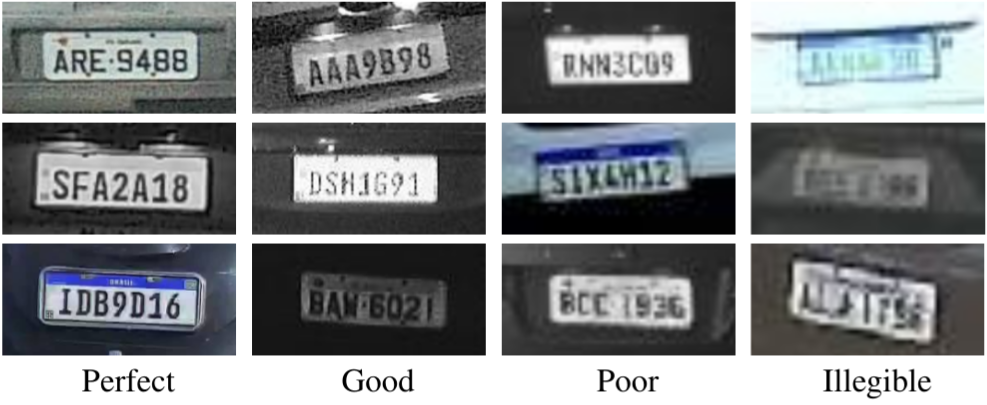
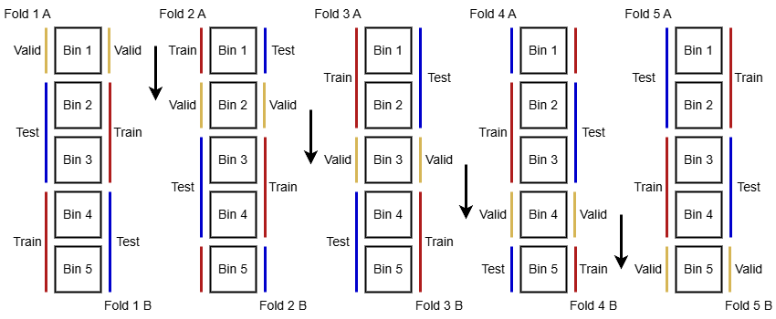

# LPLCv2: An Expanded Dataset for Fine-Grained License Plate Legibility Classification

The repository for the LPLCv2 Dataset. Features fine-grained annotations for LPs (rectangular box), LP OCR, vehicle data, legibility level, camera ID and various capture scenarios. LPLCv2 is an official extension of the LPLC dataset.

<p align='center'>

</p>

The updated benchmark is comprised of 37,099 images, with 41,487 license plates annotated in total. Each license plate is annotated according to readability (4 levels), OCR (for X of the annotated plates), bounding box (a rectangle), vehicle details (make, model, type and color, for Y of the annotated plates), the camera ID, capture condition (raining, faulty cameras, time of day) and a vehicle-wise occlusion (valid vs. occluded attributes). Full dataset statistics, alongside an annotation example, are available below.

<table border="1px solid black" align='center'>
  <tr>
    <th colspan="2">
        Images by Time of Day
    </th>
    <th colspan="2" style="border-right:4px solid black">
        Images by Attributes
    </th>
    <th colspan="2">
        LPs by Legibility
    </th>
    <th colspan="2">
        Other attributes
    </th>
  </tr>
  <tr>
    <th>
      Class
    </th>
    <th>
      Amount
    </th>
    <th>
      Attribute
    </th>
    <th style="border-right:4px solid black">
      Amount
    </th>
    <th>
      Class
    </th>
    <th>
      Amount
    </th>
    <th>
      Attribute
    </th>
    <th>
      Amount
    </th>
  </tr>
  <tr>
    <td>
      Morning
    </td>
    <td align='center'>
      10,998
    </td>
    <td>
      Faulty Camera
    </td>
    <td align='center' style="border-right:4px solid black">
      3,690
    </td>
    <td>
      Perfect
    </td>
    <td align='center'>
      18,425
    </td>
    <td>
      Vehicle Visible
    </td>
    <td align='center'>
      38,039
    </td>
  </tr>
  <tr>
    <td>
      Afternoon
    </td>
    <td align='center'>
      12,799
    </td>
    <td>
      Raining
    </td>
    <td align='center' style="border-right:4px solid black">
      770
    </td>
    <td>
      Good
    </td>
    <td align='center'>
      10,180
    </td>
    <td>
      Vehicle Details
    </td>
    <td align='center'>
      25,506
    </td>
  </tr>
  <tr>
    <td>
      Evening
    </td>
    <td align='center'>
      9,157
    </td>
    <td>
      Has Camera ID
    </td>
    <td align='center' style="border-right:4px solid black">
      29,965
    </td>
    <td>
      Poor
    </td>
    <td align='center'>
      7,520
    </td>
    <td>
      LP Text Available
    </td>
    <td align='center'>
      36,414
    </td>
  </tr>
  <tr>
    <td>
      Night
    </td>
    <td align='center'>
      4,145
    </td>
    <td>
      → Total Images
    </td>
    <td align='center' style="border-right:4px solid black">
      37,099
    </td>    <td>
      Illegible
    </td>
    <td align='center'>
      5,362
    </td>
    <td>
      → Total LPs
    </td>
    <td align='center'>
      41,487
    </td>
  </tr>
</table>

<p align='center'>

</p>

The LPLCv2 dataset is available under request. If you are interested, please contact us (lmlwojcik@inf.ufpr.br or menotti@inf.ufpr.br) through an e-mail titled "2026 LPLCv2 Request Form". Please inform your name, affiliation and purpose of use. Also inform one or two of your recent publications (up to 5 years), if any. 

All samples in the dataset can only be used by the applicant, and only for academic research. The dataset may not be employed in commercial usage, and publications involving it must provide the proper acknowledgment. The BibTeX citation is available below.

```
@article{wojcik2026lplcv2,
  title = {{LPLCv2}: An Expanded Dataset for Fine-Grained License Plate Legibility Classification},
  author = {L. {Wojcik} and E. A. F. {Machoski} and and E. {Nascimento Jr.} and R. {Laroca} and D. {Menotti}},
  year = {2026},
  journal = {International Joint Conference on Neural Networks (IJCNN)},
  volume = {},
  number = {},
  pages = {1-6},
  doi = {10.1109/SIBGRAPI67909.2025.11223367},
  issn = {2161-4407},
}
```

## Experiments reproduction

Our results are the average from the test set of a double 5-fold experiment run, where we split the dataset into a 40/20/40 distribution and each fold is used for training twice, alternating the two 40% distributions for training and testing once, resulting in 10 runs. This is illustrated below.

<p align='center'>

</p>

The folds used for each training scenario are made available as part of the dataset. To generate new distributions, use the `gen_splits.py` script. Its usage is illustrated below. This script generates new n-fold distributions if the flag `--load_folds` is not provided (defaulting to `False`). Otherwise, the folds are loaded from memory according to the output dir provided in command line (`--output_dir [DIR, optional, default='LPLCv2/folds/']`) or the configuration file. Alternate training/test partitions are generated by default, and can be turned off by the flag `--cross_fold False` (defaults to `True`).

```
python gen_splits.py \
    --config [CONFIG_FILE] \
    --class_config [SCENARIO_CONFIG, optional] \
    --load_folds [optional]
```

The class configurations correspond to the class mapping used in the experiments presented in our dataset. Our default split generation config, as well as all configs for all scenarios are available under `configs/`.

Furthermore, this script may also prepare the dataset for training by generating a directory of symbolic links with the training/validation/test splits for every fold in a given scenario at `--sldir [DIR, optional, default='sldir']` if the flag `--gen_sym_links` is provided (defaults to `True`). The directory structure follows the YOLO and TensorFlow conventions, such as follows:

```
sldir
├── scen0
|   ├── 0_1
|   │   ├── train
|   |   |   ├── 0
|   |   |   ├── 1
|   |   |   ├── 2
|   |   |   └── 3
|   │   ├── val
|   |   |   ├── 0
|   |   |   ├── 1
|   |   |   ├── 2
|   |   |   └── 3
|   │   └── test
|   |       ├── 0
|   |       ├── 1
|   |       ├── 2
|   |       └── 3
|   ├── 0_2
|   ├── 1_1
|   ├── 1_2
|   ├── 2_1
|   ├── 2_2
|   ├── 3_1
|   └── 3_2
├── scen1
├── scen2
└── scen3
```


## Model training and testing

To run a session (whether training or testing), the command line usage is:

```
python main.py \
    -c  [CONFIG_FILE] \
    -n  [RUN_NAME] \
    -dt [CLASS_CONFIG] \
    -f  [FOLD] \
    
    -t  [TRAIN_CONFIG, optional] \
    -v  [TEST_CONFIG, optional] \
    -p  [DO_PREDICT, optional] \
    -pt [PREDICT_PARTITION, optional] \

    -d  [DEVICE, optional] \
    -bs [BATCH_SIZE, optional] \
    -m  [LOAD_MODEL, optional]
```

The class config argument must correspond to one of the class configs available in `configs/split_configs/`, while fold must correspond to one of the fold dirs generated by `gen_splits.py` (e.g. `-dt configs/split_configs/config_classes_base.json -f 0_1`). The load_model flag is used for picking up a half-trained model. All training and testing arguments should be supplied by the configuration file. Our default configs are found in `configs/` for `resnet`. By default, we employ an early stopping strategy.

An example for reproducing our experiments can be found in `scripts/run_experiments.sh`.

